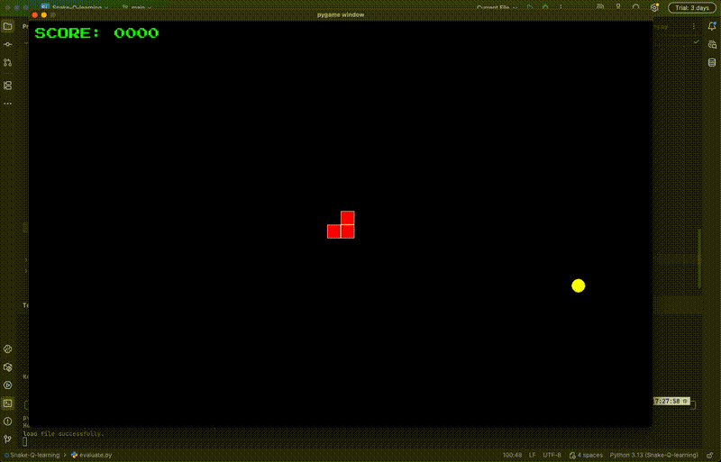

# Q-learning for playing Snake game

## Introduction

Here is my Python source code for training an agent to play Snake using the Q-learning algorithm.

Talking about performance, my agent achieved a score of 70, which is much better than what I initially expected from a basic Q-learning approach.

In this project, I focused only on the Q-learning algorithm. You can check out my Snake game with DQL implementation on my GitHub ([Snake Deep Q-learning](https://github.com/tuan-nv0505/Snake-double-deep-Q-learning)).

⭐ If you find this project interesting or helpful, please consider giving it a star on GitHub — it really motivates me to keep improving and sharing more AI projects!

    
    <i>Result</i>

## How to use my code

With my code, you can:

* **Train your model** by running `python train.py`.
* **Test your trained model** by running `python evaluate.py`.

## Requirements
* **numpy**
* **pygame**
